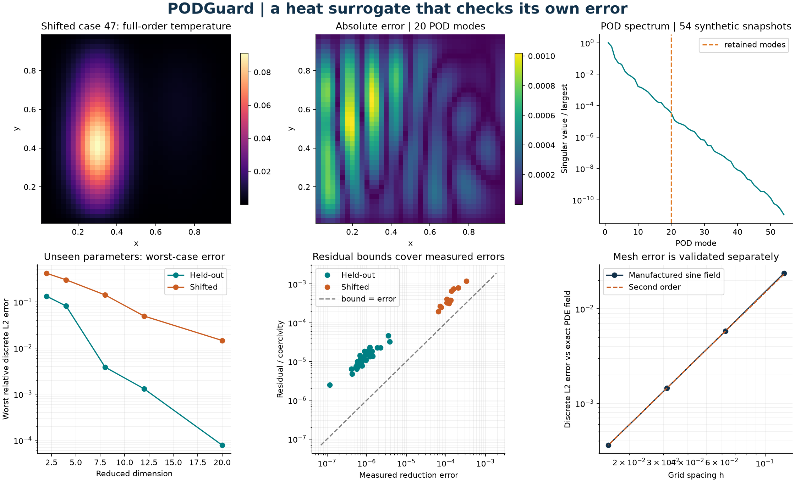

# PODGuard

**A heat surrogate that checks its own error.** PODGuard reduces a 1,521-unknown
steady thermal model to 20 coordinates and evaluates an inexpensive residual
bound for every prediction. A deliberately shifted parameter study shows why
small training error alone does not establish reliability.



The default experiment uses 54 synthetic training solves and 48 independent test
parameters. The maximum relative discrete L2 error is **0.0079%** for the 36
held-out interpolation cases and **1.46%** for the 12 shifted cases. All three
bounds cover their measured errors in the 240 rank/case comparisons. These are
finite experiment results, not a guarantee of accuracy on arbitrary parameters.
See [raw measurements](results/validation.json) and [validation](docs/validation.md).

## Install and reproduce

Python 3.11 or newer; NumPy, SciPy and Matplotlib. The project uses Python with
compiled library linear algebra. It does not require a custom C++ build.

```sh
python -m venv .venv
# Linux/macOS: source .venv/bin/activate
# Windows PowerShell: .\.venv\Scripts\Activate.ps1
python -m pip install -e ".[dev]"
podguard --output out
python examples/predict_temperature.py
python -m pytest --cov=podguard --cov-report=term-missing
ruff check .
ruff format --check .
python -m build
python -m pip check
```

For repeatable timing, set `OPENBLAS_NUM_THREADS=1` and `OMP_NUM_THREADS=1` before
starting Python. PowerShell: `$env:OPENBLAS_NUM_THREADS='1'` and
`$env:OMP_NUM_THREADS='1'`. The recorded environment is in
[requirements-repro.txt](requirements-repro.txt); those exact versions describe
the Windows/Python 3.14 run, while the version ranges support the CI matrix.

Build creates a source archive and wheel in `dist`. Install the wheel into a new
virtual environment using `python -m pip install path/to/podguard-0.1.0-py3-none-any.whl`.
Run the same example and CLI from the installed package. CI does this on Windows
and Ubuntu with Python 3.11 and 3.14.

## Model and discretization

The dimensionless unit plate has two synthetic distributed heat sources,
anisotropic constant conductivities and a uniform heat-loss term:

$$-k_x u_{,xx}-k_y u_{,yy}+\beta u=a f_1+b f_2,\qquad
u|_{\partial(0,1)^2}=0,$$

where $k_x,k_y>0$ and $\beta\ge0$. The Gaussian centers are $(0.30,0.40)$ and
$(0.72,0.65)$ with widths 0.085 and 0.12. Each load has unit discrete integral;
arbitrary signed amplitudes are supported. All sample fields are generated here.

An $n\times n$ interior grid with $h=1/(n+1)$ and centered differences gives

$$A(\mu)u=f(\mu),\quad A=k_x A_x+k_y A_y+\beta I,\quad
A_x=I_n\otimes T,\quad A_y=T\otimes I_n,$$

where $T=h^{-2}\operatorname{tridiag}(-1,2,-1)$. Flattening is row-major with
x varying fastest. Boundary values are eliminated. The discrete inner product
is $\langle v,w\rangle_h=h^2v^Tw$; its norm approximates the continuum L2 norm.
Fresh sparse direct solves provide the full-order reference.

## POD, projection and the online bound

Compute the uncentered weighted snapshot SVD
$h[u(\mu_1),\ldots,u(\mu_m)]=U\Sigma W^T$ and retain $V=U_r/h$.
Then $h^2V^TV=I$ and the reduced coordinates solve

$$[h^2 V^T A(\mu)V]z=h^2 V^Tf(\mu),\qquad u_r=Vz.$$

The three operator terms and two source columns are projected offline. POD tail
energy measures training projection error, not held-out Galerkin error. The code
keeps the computed reduced mass matrix instead of assuming exact orthogonality.

For residual $r=f-Au_r$ and full-order error $e=u-u_r$, $Ae=r$. The smallest
eigenvalue is known analytically on this grid:

$$\alpha(\mu)=(k_x+k_y)\frac{4}{h^2}\sin^2\left(\frac{\pi h}{2}\right)+\beta.$$

Thus, in exact arithmetic,

$$\|e\|_h\le\Delta_2=\frac{\|r\|_h}{\alpha},\qquad
\|e\|_{A,h}\le\Delta_E=\frac{\|r\|_h}{\sqrt\alpha}.$$

The mean output is interior quadrature $J(u)=h^2\mathbf1^Tu$ over the unit-area
plate. Cauchy-Schwarz yields $|J(e)|\le nh\Delta_2$.
These bounds cover **model reduction error on the chosen grid**, not continuum
discretization error. The latter is checked independently with a manufactured
sine solution.

For a fast residual, factor offline

$$B=h[f_1,f_2,A_xV,A_yV,V]=QR,\qquad
c=[a,b,-k_xz^T,-k_yz^T,-\beta z^T]^T.$$

Then $\|r\|_h=\|Rc\|_2$. Keeping QR factors avoids the cancellation of computing
$\sqrt{c^TB^TBc}$ through squared residual terms. The online solve costs
$O(r^3)$ and residual evaluation $O(r^2)$, independent of full grid dimension.
Field reconstruction remains $O(n^2r)$ and is an explicit separate call. This
orthonormal residual representation follows the general approach discussed by
[Buhr et al.](https://arxiv.org/abs/1407.8005); the implementation here is original.

Finite precision is not interval certified. `roundoff_scale` is the heuristic
$32\epsilon\|R\|_F\|c\|_2$, not an additional rigorous bound. Residuals at or below
that scale should be treated as unresolved. QR also uses offline storage
$O(n^2r)$, plus snapshot storage $O(n^2m)$ during fitting.

## API and CLI

```python
from podguard import Parameters, ThermalPlate, fit_pod
from podguard.study import training_parameters

plate = ThermalPlate(n=39)
fit = fit_pod(plate, training_parameters(), rank=20)
p = Parameters(kx=0.8, ky=1.7, reaction=4, source_a=0.35, source_b=0.65)
prediction = fit.model.predict(p)  # coordinates, mean and three bounds
temperature = fit.model.reconstruct(prediction)  # optional full field
print(prediction.mean, prediction.mean_bound)
```

`ThermalPlate(n, sources=...)` accepts two custom nodal source columns with shape
`(n*n, 2)`. `solve`, `norm`, `energy_norm`, `mean`, `operator` and `coercivity` expose
the reference model. `fit_pod` rejects invalid ranks, zero snapshot sets and
rank-deficient requests. `ReducedModel(plate, basis)` accepts a supplied basis
orthonormal in the discrete inner product. Basis/source properties return copies;
private arrays and plate grid metadata must not be mutated after construction.
Only reconstruct predictions from their originating model.

```sh
podguard --output out --n 39 --rank 20
python -m podguard.cli --help
```

The output directory contains `training.csv`, `spectrum.csv`, `audit.csv`,
`convergence.csv`, `field.csv`, `validation.json` and `podguard_audit.png`.
Existing files with these names are replaced. Exit status is 0 when the six
numerical checks pass, 1 on a failed numerical check, and 2 on invalid input or
output-path errors. A low rank may still pass bound checks while being inaccurate;
inspect `max_held_out_relative_l2_error` against your required tolerance.

## Experiment and limitations

Training uses $k_x\in\{0.4,1,2.5\}$, $k_y\in\{0.5,1.5,3\}$,
$\beta\in\{0,6,18\}$, with both source endpoints. A fixed seed produces 36 unseen
parameters inside the training box. Another 12 use $k_x\in[0.04,0.15]$,
$k_y\in[4,8]$, $\beta\in[22,40]$ to stress extrapolation. No test samples are used
to fit the basis. Ranks 2, 4, 8, 12 and 20 expose the error/dimension tradeoff.

The recorded local run measured roughly 3.54 ms for assembly plus a fresh sparse
full solve versus 0.0628 ms for the online reduced solve, bound and mean, excluding
field reconstruction. Offline fitting took 0.192 s. These are descriptive medians
over five batches of 48 queries. They do not compare against a cached or optimized
full-order baseline; BLAS, hardware and load affect results. There is no claimed
universal speedup or timing-based test. The JSON records the latest sample timing.

Only linear, steady, constant-coefficient 2D heat conduction with homogeneous
Dirichlet data is supported. No transient/nonlinear conduction, spatially varying
coefficients, non-affine geometry, mesh adaptation, automatic basis enrichment,
uncertainty quantification or persistent model format is implemented. The bound
can be conservative and becomes weak as coercivity decreases. Extreme scales,
overflow, underflow and ill-conditioned reduced systems are not validated operating
regimes. POD does not enforce nodal positivity.

## Provenance and references

The topic was selected from local AI in COME filenames
`08_Clustering_PCA_POD.pdf` and `09_Metamodeling_Surrogatemodeling.pdf`, with general
elliptic-discretization context from AFEM/CFD. Only local filenames were inspected;
no course prose, exercise code, solutions, exams or datasets are included.
Implementation, synthetic data and experiment design were created for this project.

- Buhr, Engwer, Ohlberger and Rave (2014),
  [A numerically stable a posteriori error estimator for reduced basis approximations of elliptic equations](https://arxiv.org/abs/1407.8005).
- [SciPy sparse direct solve documentation](https://docs.scipy.org/doc/scipy/reference/generated/scipy.sparse.linalg.spsolve.html),
  describing the numerical library used for full-order solves.
- [Numerical derivation and validation record](docs/validation.md), including the
  independent manufactured solution and test tolerances.

MIT licensed. See [CONTRIBUTING.md](CONTRIBUTING.md) for the branch/check workflow.

## Academic paper

Read the [research note (PDF)](paper/paper.pdf), edit the [LaTeX source](paper/paper.tex),
or follow the [compilation instructions](paper/README.md). The manuscript includes
methods, measured validation, limitations, and references within five pages.
